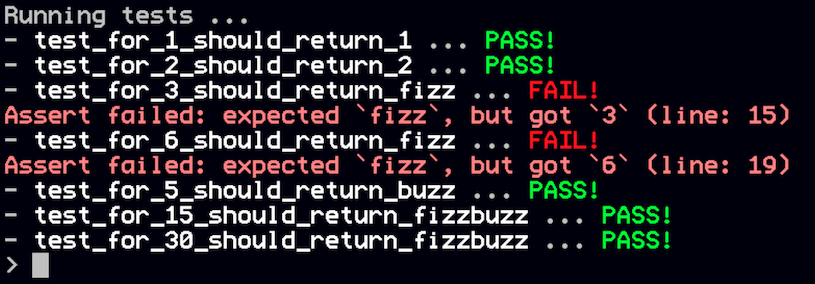

# MiniTest

A simple, minimalistic, unit-testing framework for the [Mini Micro](https://miniscript.org/MiniMicro) fantasy-computer.

## Installation

Just copy the MiniScript file into your project.

Another approach might be to clone this repository and symlink the MiniScript file into your project.

## Usage

Start by importing the "miniTest" module:

```
import "miniTest"
```

Add some tests by defining functions with the prefix "`test_`". What comes after that is up to you. Use the rest of the function name to describe your test case.

Example:

```
test_one_plus_one_equals_two = function
	...
end function
```

Inside a test you should use one of the available assert-functions (see section below).

Example:

```
test_one_plus_one_equals_two = function
	assertEqual 1+1, 2, "Adding did not work"
end function
```

Finally, invoke the "test" function to start running the tests:

```
test
```

Sample output for a (buggy) "FizzBuzz" implementation:



As you can see, in the case of failure the line-number is reported.

## Assert-Functions

The following assert-functions are available:

|Name|Parameters|
|----|----------|
|assertEqual|actual, expected, [message]|
|assertTrue|condition, [message]|
|assertFalse|condition, [message]|
|assertNull|value, [message]|
|assertNotNull|value, [message]|

## Before/After Hooks

It is possible to run code _before_ and _after_ each test.

Just define a `beforeEach` and / or `afterEach` function as needed.